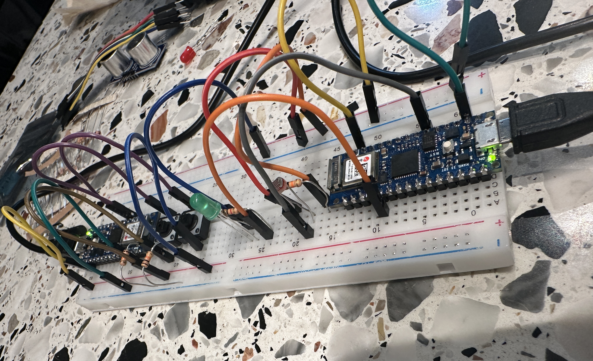

# Smart LED and Remote Control System

💡 A Smart LED System with Remote Control for IoT Project

---

## ⚙️ **Project Features**  

### **Smart LED (Peripheral Device)**  
- **LED Control Functions:**  
  - **Manual ON/OFF:** Control LED state with BLE commands.  
  - **Brightness Adjustment:** Adjust brightness in 10 levels (0-9).  
  - **Auto Mode:** Automatically turn the LED ON/OFF based on ambient light.  

### **Remote Control (Central Device)**  
- **BLE-Enabled Remote:**  
  - **Buttons:** ON, OFF, AUTO, UP, DOWN  
  - **Command Transmission:** Send BLE commands to the Smart LED.  

### **BLE Specifications**  
- **Service UUID:** `180A`  
- **Characteristic UUID:** `2A57`  

---

## 🛠️ **Hardware Configuration**  

### **Smart LED (`smartled.ino`)**  
- **Components:**  
  - **LED:** Pin `2` (PWM-supported)  
  - **Light Sensor:** Pin `A2` (Analog input)  

### **Remote Control (`smartledremote.ino`)**  
- **Components:**  
  - **Buttons:**  
    - ON → Pin `2`  
    - OFF → Pin `3`  
    - AUTO → Pin `4`  
    - Brightness UP → Pin `5`  
    - Brightness DOWN → Pin `6`  

---

## 📶 **BLE Command Mapping**  

| **Button**           | **Command**     | **Action**               |
|----------------------|------------------|--------------------------|
| **OFF**              | `0`              | Turn OFF the LED         |
| **ON**               | `1`              | Turn ON the LED          |
| **AUTO**             | `2`              | Enable Auto Mode         |
| **Brightness UP**    | `B<value>`       | Increase Brightness (0-9)|
| **Brightness DOWN**  | `B<value>`       | Decrease Brightness (0-9)|  

---

## 💻 **Example Commands**  

1. **Turn ON the LED:**  
   - **Command Sent:** `1`  
   - **Result:** LED is turned ON  

2. **Enable Auto Mode:**  
   - **Command Sent:** `2`  
   - **Result:** The LED turns ON/OFF based on the light sensor reading.  

3. **Adjust Brightness:**  
   - Current Brightness: `5`  
   - **UP Command Sent:** `B6` (Brightness increased to `6`)  
   - **DOWN Command Sent:** `B4` (Brightness decreased to `4`)  

---

## 🗂️ **File Submission**  

- `smartled.ino` - **Smart LED Source Code**  
- `smartledremote.ino` - **Remote Control Source Code**  

---

## 📸 **Project Preview**  

  

---
